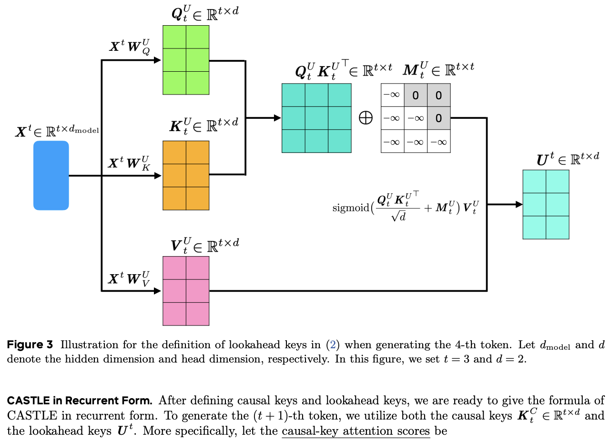

</img>

## Lookahead Keys Attention (wip)

Causal Attention with [Lookahead Keys](https://arxiv.org/abs/2509.07301)

## Installation

```bash
pip install lookahead-keys-attention
```

## Usage

```python
import torch
from lookahead_keys_attention import Castle

# lookahead keys attention

model = Castle(
    dim = 512,           # input dimension
    heads = 8,           # number of attention heads
    dim_head = 64,       # dimension per head
    use_triton = None    # auto set to if cuda and triton is available, but can be forced
).cuda()

seq = torch.randn(2, 128, 512).cuda()

# parallel

parallel_output = model(seq)  # (batch_size, seq_len, dim)

# sequential

cache = None
outputs = []

for token in seq.unbind(dim = 1):
    output, cache = model(token, cache = cache, return_next_cache = True)
    outputs.append(output)

seq_output = torch.cat(outputs, dim = 1)

assert torch.allclose(parallel_output, seq_output, atol = 1e-3)
```

## Char level Enwik8

Make sure `uv` is installed (`pip install uv`)

Then

```shell
$ uv run train_triton.py
```

## Citations

```bibtex
@inproceedings{Song2025CausalAW,
    title   = {Causal Attention with Lookahead Keys},
    author  = {Zhuoqing Song and Peng Sun and Huizhuo Yuan and Quanquan Gu},
    year    = {2025},
    url     = {https://api.semanticscholar.org/CorpusID:281218151}
}
```
